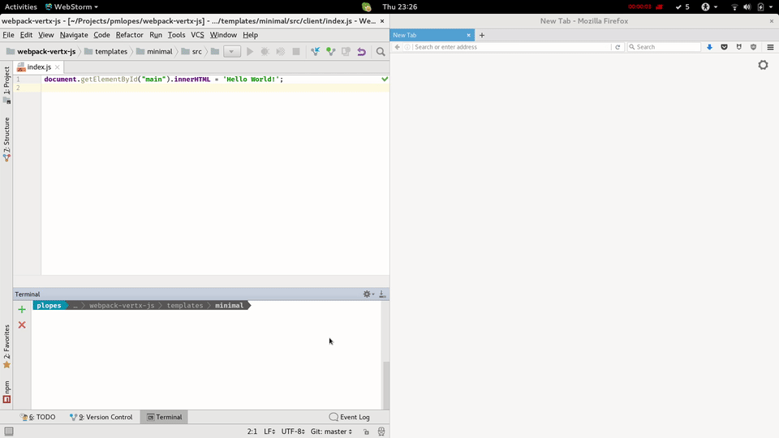

# A Workflow for Modern Web Development

Modern web development is more than just a HTTP server and generation of HTML on a request response workflow.

This would be the case in the old days of Servlet programming, nowadays we need to build complex single page applications with many resources and complex build steps.

With Vert.x we can define a workflow that is familiar both to backend developers and as well to frontend developers.

## A Backend web application

A typical backend application would be a server serving some content, for this one would use maven to build the application, your `pom.xml` would look like:

```xml
<?xml version="1.0" encoding="UTF-8"?>
<project xmlns="http://maven.apache.org/POM/4.0.0"
         xmlns:xsi="http://www.w3.org/2001/XMLSchema-instance"
         xsi:schemaLocation="http://maven.apache.org/POM/4.0.0 http://maven.apache.org/xsd/maven-4.0.0.xsd">

  <modelVersion>4.0.0</modelVersion>
  <packaging>jar</packaging>

  <groupId>com.example</groupId>
  <artifactId>com.example</artifactId>
  <version>1.0.0</version>

  <name>example</name>

  <dependencies>
    <dependency>
      <groupId>io.vertx</groupId>
      <artifactId>vertx-web</artifactId>
      <version>3.4.2</version>
    </dependency>
    <dependency>
      <groupId>xyz.jetdrone</groupId>
      <artifactId>hot-reload</artifactId>
      <version>0.0.2</version>
    </dependency>
  </dependencies>

  <build>
    <pluginManagement>
      <plugins>
        <!-- We specify the Maven compiler plugin as we need to set it to Java 1.8 -->
        <plugin>
          <artifactId>maven-compiler-plugin</artifactId>
          <version>3.1</version>
          <configuration>
            <source>1.8</source>
            <target>1.8</target>
          </configuration>
        </plugin>
      </plugins>
    </pluginManagement>
    <plugins>
      <plugin>
        <groupId>org.apache.maven.plugins</groupId>
        <artifactId>maven-shade-plugin</artifactId>
        <version>2.3</version>
        <executions>
          <execution>
            <phase>package</phase>
            <goals>
              <goal>shade</goal>
            </goals>
            <configuration>
              <transformers>
                <transformer implementation="org.apache.maven.plugins.shade.resource.ManifestResourceTransformer">
                  <manifestEntries>
                    <Main-Class>io.vertx.core.Launcher</Main-Class>
                    <Main-Verticle>com.example.Main</Main-Verticle>
                  </manifestEntries>
                </transformer>
                <transformer implementation="org.apache.maven.plugins.shade.resource.AppendingTransformer">
                  <resource>META-INF/services/io.vertx.core.spi.VerticleFactory</resource>
                </transformer>
              </transformers>
              <outputFile>${project.basedir}/target/${project.artifactId}-${project.version}-fat.jar</outputFile>
            </configuration>
          </execution>
        </executions>
      </plugin>
    </plugins>
  </build>
</project>
```

And the source code structure would be:

```
.
├── pom.xml
└── src
    └── main
        ├── java
        │   └── com
        │       └── example
        │           └── Main.java
        └── resources
            └── webroot
                └── index.html

```

### A minimal server

The minimal `Server` would be the `Main.java` file and it should look like:

```java
package com.example;

import io.vertx.core.AbstractVerticle;
import io.vertx.ext.web.Router;
import io.vertx.ext.web.handler.StaticHandler;

import xyz.jetdrone.vertx.hot.reload.HotReload;

public class Main extends AbstractVerticle {

  @Override
  public void start() throws Exception {

    final Router router = Router.router(vertx);
    // development hot reload
    router.get().handler(HotReload.create());
    // Serve the static resources
    router.route().handler(StaticHandler.create());

    vertx.createHttpServer().requestHandler(router::accept).listen(8080);
  }
}
```

It is very basic, it uses the hot deploy handler and serves static files.

While the `index.html` would be:

```html
<html>
<head>
  <title>Hot Reload</title>
</head>
<body>
  <div id="main"></div>
  <script src="bundle.js"></script>
  <script src="/hot-reload/script" type="application/javascript"></script>
</body>
</html>
``` 

### What is this hot reload?

You might have noticed these hot reload references. Hot reload is a handler that will reload your page every time your server restarts, it is a development time handler that you can ignore once you go into production but will save you many `F5` clicks.

You will see it in action later.

## A frontend application

Lets look into the frontend aspect. Modern web development is complex, the most popular choices are between using:

* EcmaScript6
* TypeScript

For programming and

* Angular4
* React.js
* Vue.js
* Aurelia
* Backbone

as framework. But lets keep it simple, a simple hello world using [webpack](https://webpack.js.org/) since pretty much all these options rely on it as a base build and bundler.

Your project will have some more files:

```
.
├── package.json
├── pom.xml
├── src
│   ├── client
│   │   └── index.js
│   └── main
│       ├── java
│       │   └── com
│       │       └── example
│       │           └── Main.java
│       └── resources
│           └── webroot
│               └── index.html
└── webpack.config.js
```

### package.json

The `package.json` file is the couter part of `pom.xml` for the frontend world, a minimal example would be:

```json
{
  "name": "basic",
  "version": "1.0.0",
  "description": "",
  "private": true,

  "author": "Paulo Lopes",
  "license": "MIT",

  "dependencies": {
  },

  "devDependencies": {
    "babel-core": "^6.22.1",
    "babel-loader": "^6.2.10",
    "webpack": "^2.2.0",
    "webpack-vertx-plugin": "0.0.2"
  }
}
```

Remember that I want to make a `hello world` example so there are no `dependencies` just `devDependencies` so we can use webpack.

### Configure webpack

Webpack is controlled by the file `webpack.config.js` it is code as oposed to `package.json` for this example it should be:

```js
var path = require('path');
const VertxPlugin = require('webpack-vertx-plugin');

module.exports = {
  entry: path.resolve(__dirname, 'src/client/index.js'),
  output: {
    filename: 'bundle.js',
    path: path.resolve(__dirname, 'src/main/resources/webroot')
  },
  module: {
    loaders: [
      { test: /\.js$/, exclude: /node_modules/, loader: 'babel-loader' }
    ]
  },

  plugins: [
    new VertxPlugin({
      fatJar: 'target/com.example-1.0.0-fat.jar'
    })
  ]
};
```

What we're saying here is that our application starts from the `src/client/index.js` file and we will use [babel.js](https://babeljs.io/) to transpile modern JavaScript to JavaScript browsers can handle.

We're using a special Vert.x plugin that does some nice tricks such as extracting `js` from java `jar`s so they are available to babel. This gives you better code analysis and more optimized bundles.

So finally lets look at `index.js`:

```js
document.getElementById("main")
  .innerHTML = 'Hello World!';
```

Simple!

## Building you application

With the given setup `webpack` will drive the build. The reason is that in order to build the backend one needs the frontend application under the `src/main/resources` so it can be packaged with the final runnable jar.

Webpack does not know anything about java or maven so that is where the plugin gets in action. It will run `maven package` once webpack sucessfuly builds.

So the flow will be:

1. webpack start
2. babel will transpile js if needed
3. webpack generates a `bundle.js` under `src/main/resources/webroot`
4. VertxPlugin will run `mvn package`

But to you it would be just as running:

```
$ webpack
Running: mvn...
Running: mvn...
Hash: ceaea9fa624993f698d5
Version: webpack 2.7.0
Time: 6237ms
        Asset     Size  Chunks             Chunk Names
    bundle.js  2.73 kB       0  [emitted]  main
bundle.js.map  2.88 kB       0  [emitted]  main
   [0] ./src/client/index.js 59 bytes {0} [built]
```

This works great but you will find yourself restarting and reloading the server and browser all the time as you keep developing your application.

## Watching for changes

In order to optimize the workflow, webpack can watch for changes and trigger a new build. However this does not apply to the java side of the project.

!!! note
    You can also watch changes with vert.x by running `java -jar yourjar.jar --redeploy="src/**" --on-redeploy="cmd to run"`.

But that would not be productive if you would need to do it manually so the plugin will identify when webpack is running in watch mode and do it for you.

So your run would be:

```
webpack --watch

Webpack is watching the files…

Running: mvn...
Running: java...
Hash: ceaea9fa624993f698d5
Version: webpack 2.7.0
Time: 3641ms
        Asset     Size  Chunks             Chunk Names
    bundle.js  2.73 kB       0  [emitted]  main
bundle.js.map  2.88 kB       0  [emitted]  main
   [0] ./src/client/index.js 59 bytes {0} [built]
Sep 07, 2017 11:22:24 PM io.vertx.core.impl.launcher.commands.Watcher
INFO: Watched paths: [/home/plopes/Projects/pmlopes/webpack-vertx-js/templates/minimal/src/main]
Sep 07, 2017 11:22:24 PM io.vertx.core.impl.launcher.commands.Watcher
INFO: Starting the vert.x application in redeploy mode
Sep 07, 2017 11:22:24 PM io.vertx.core.impl.launcher.commands.VertxIsolatedDeployer
INFO: Succeeded in deploying verticle

```

And you would see that the application would get recompiled if files are changed.

### Hot reload

Now that you can watch for changes we can use the handlers stated initially and this would be like:


